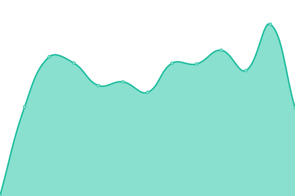
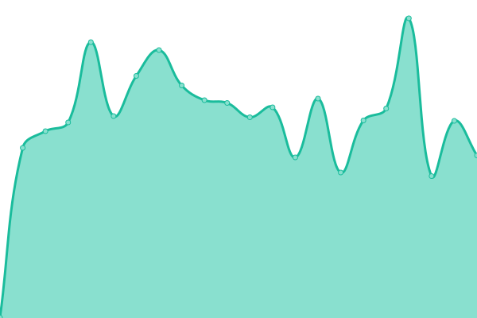

# [ESM-Suite Status](https://WEBER-marcoscheffler.github.io/esm-status): <!--live status--> **Alle Systeme betriebsbereit**

This repository contains the status page for **ESM-Suite**, powered by [Upptime](https://github.com/upptime/upptime).

<!--start: status pages-->
<!-- This summary is generated by Upptime (https://github.com/upptime/upptime) -->
<!-- Do not edit this manually, your changes will be overwritten -->
<!-- prettier-ignore -->
| URL | Status | History | Response Time | Uptime |
| --- | ------ | ------- | ------------- | ------ |
|  [ESM Frontend](https://esm.weber-online.com) | Erreichbar | [esm-frontend.yml](https://github.com/WEBER-marcoscheffler/esm-status/commits/HEAD/history/esm-frontend.yml) | 

 530ms
     
 | 

<a href="https://esm-status.weber-online.com/history/esm-frontend">90.18%</a>
    

|  [ESM Backend API](https://esm.weber-online.com/api/healthz) | Erreichbar | [esm-backend-api.yml](https://github.com/WEBER-marcoscheffler/esm-status/commits/HEAD/history/esm-backend-api.yml) | 

 130ms
     
 | 

<a href="https://esm-status.weber-online.com/history/esm-backend-api">90.26%</a>
    

|  [ESM Dev Frontend](https://esm-dev.weber-online.com) | Erreichbar | [esm-dev-frontend.yml](https://github.com/WEBER-marcoscheffler/esm-status/commits/HEAD/history/esm-dev-frontend.yml) | 

 521ms
     
 | 

<a href="https://esm-status.weber-online.com/history/esm-dev-frontend">90.33%</a>
    

|  [ESM Dev Backend API](https://esm-dev.weber-online.com/api/healthz) | Erreichbar | [esm-dev-backend-api.yml](https://github.com/WEBER-marcoscheffler/esm-status/commits/HEAD/history/esm-dev-backend-api.yml) | 

 129ms
     
 | 

<a href="https://esm-status.weber-online.com/history/esm-dev-backend-api">90.41%</a>
    

<!--end: status pages-->

## How it works

- GitHub Actions checks all endpoints every 5 minutes
- Response times and uptime data are committed to this repo
- A static status page is deployed to GitHub Pages
- Incidents are automatically created as GitHub Issues
